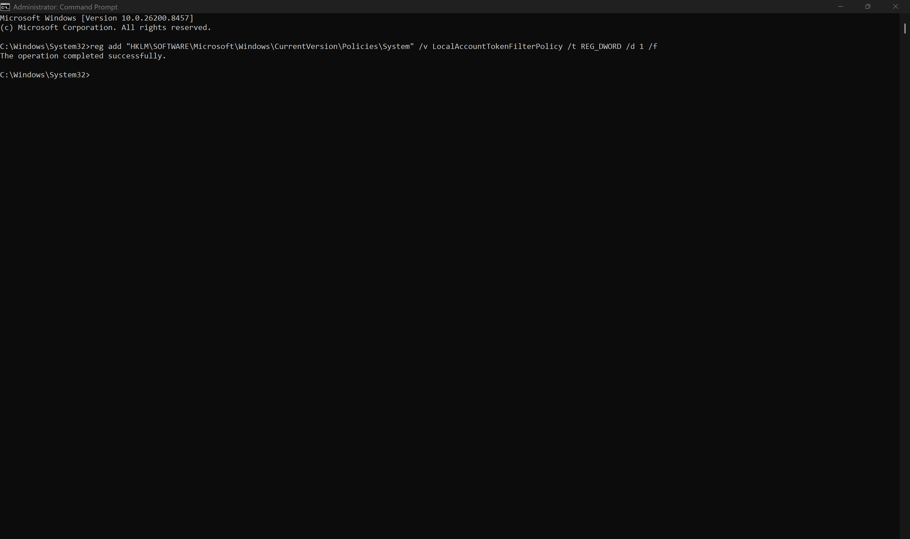
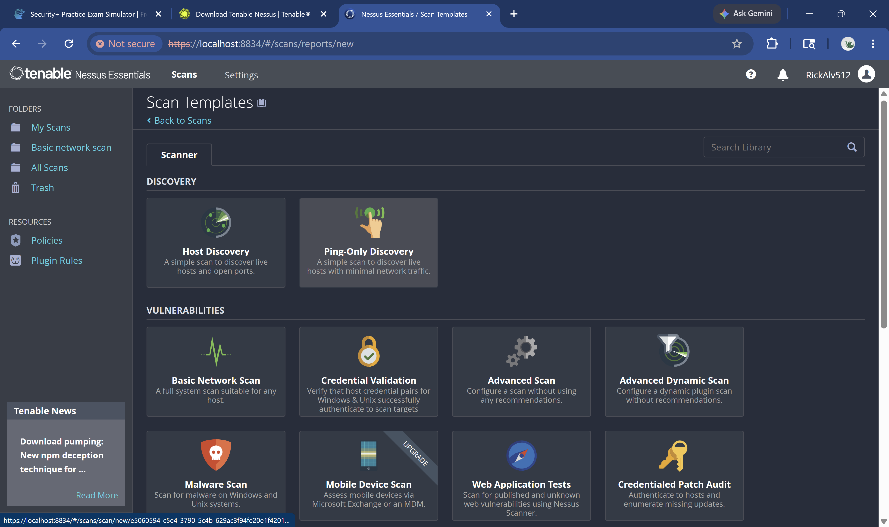
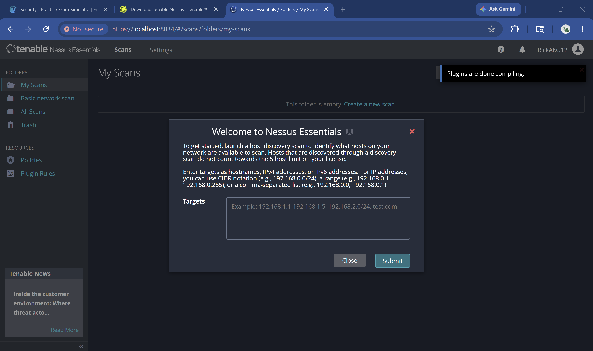
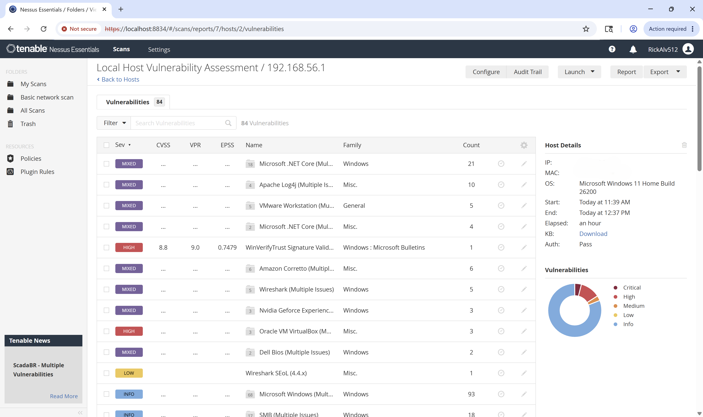
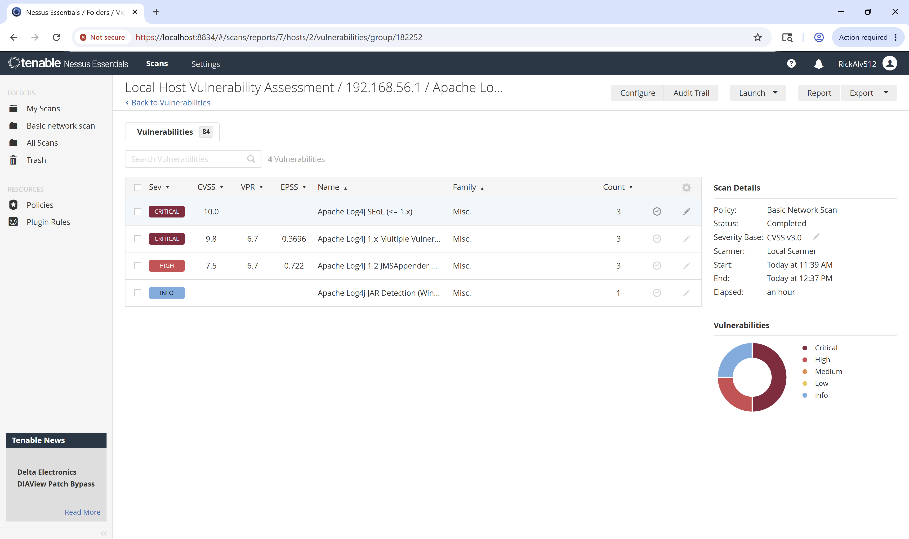
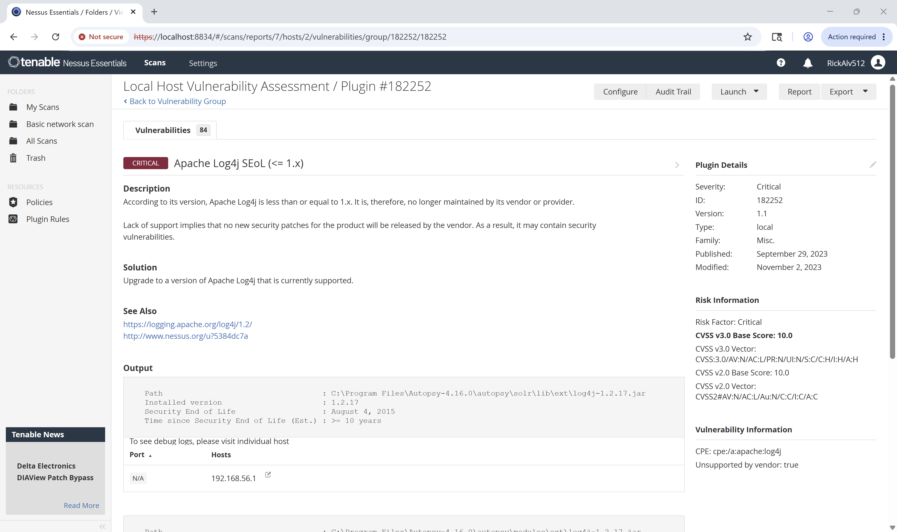
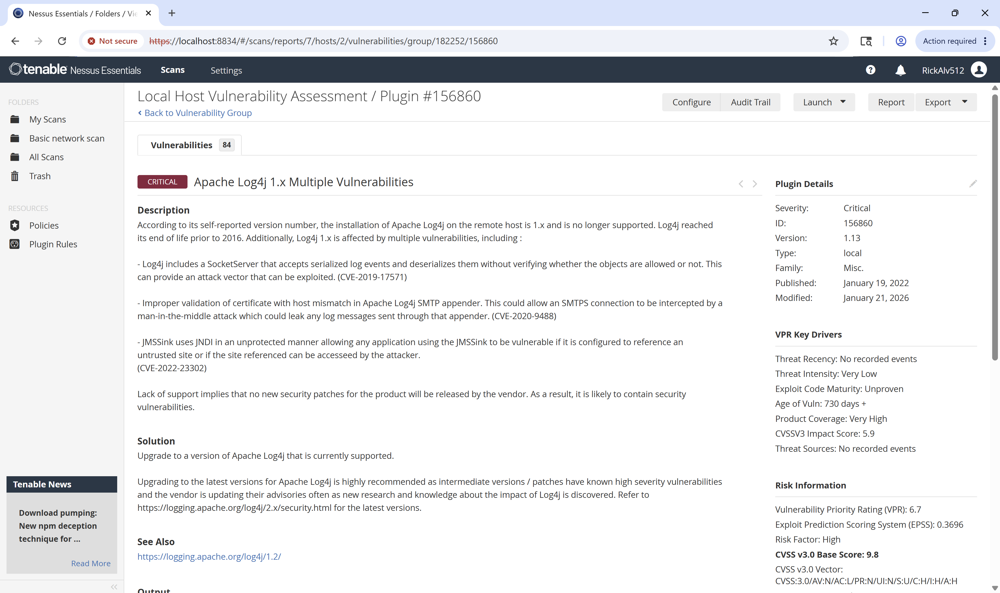
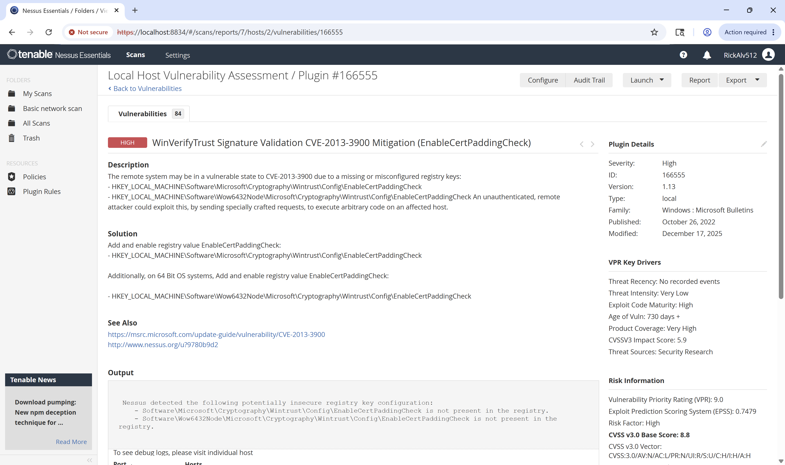
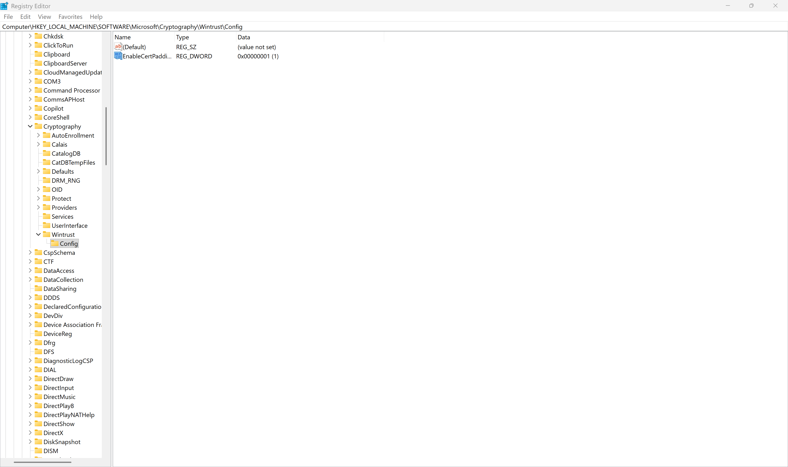
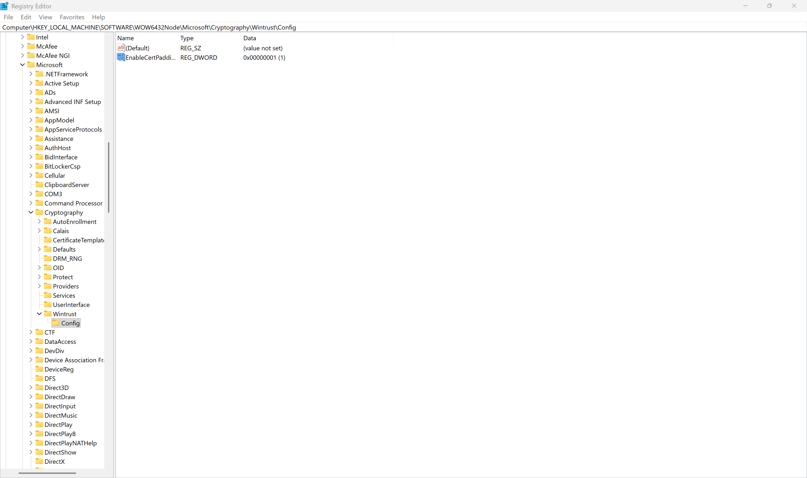

# Project 6 — Nessus Essentials Vulnerability Assessment

**Author:** Ricardo Alvarez  
**Date:** June 3, 2026  
**Target:** 192.168.56.1 (localhost)  
**OS:** Microsoft Windows 11 Home Build 26200  
**Tool:** Tenable Nessus Essentials  
**GitHub:** [RickAlv210/Cybersecurity-Portfolio](https://github.com/RickAlv210/Cybersecurity-Portfolio)

---

## 1. Executive Summary

A credentialed vulnerability assessment was conducted against a local Windows 11 host using Tenable Nessus Essentials. The scan authenticated successfully using a dedicated local administrator account and identified 84 total vulnerabilities across five severity levels.

The most significant findings center on end-of-life Apache Log4j components bundled within the Autopsy digital forensics application, presenting maximum CVSS scores and real-world exploitability. A Windows signature validation misconfiguration (CVE-2013-3900) was also identified and remediated during this assessment.

| Severity | Count | Status |
|---|---|---|
| Critical | 11 | Documented / Partially Remediated |
| High | 35 | Documented / 1 Remediated |
| Medium | 10 | Documented |
| Low | 5 | Documented |
| Informational | 23 | Reviewed |
| **Total** | **84** | **Assessment Complete** |

---

## 2. Methodology

### 2.1 Scope and Objectives
The objective of this assessment was to identify, document, and prioritize vulnerabilities on a local Windows 11 workstation using industry-standard tooling. The scope was limited to a single host at IP address 192.168.56.1.

### 2.2 Tool and Configuration
- **Tool:** Tenable Nessus Essentials (free tier, up to 16 IPs)
- **Scan Template:** Basic Network Scan
- **Severity Scoring:** CVSS v3.0
- **Scan Duration:** 11:39 AM to 12:37 PM (approximately one hour)
- **Authentication:** Credentialed scan using dedicated local Windows administrator account (Auth: Pass)

### 2.3 Authentication Challenges Documented
A key objective was conducting a credentialed scan for deeper visibility into installed software, patch levels, and registry configurations. Several real-world Windows authentication barriers were encountered and resolved during setup:

- **Windows PIN authentication** does not support NTLM/SMB network authentication protocols, which Nessus uses even on localhost. A traditional password-based local account was required.
- **Azure Active Directory domain join** blocked local credential management. The machine was enrolled in a corporate tenant, preventing local account password changes. A true local account (NessusAdmin) was created as a workaround.
- **UAC remote restriction** was enabled by default, silently blocking administrative access over network connections. The `LocalAccountTokenFilterPolicy` registry key was set to 1 to allow full administrative access for the scan account.
- **Remote Registry service** was disabled by default and required manual enabling via services.msc to allow Nessus to inspect registry-based vulnerability indicators.

These steps reflect real enterprise configurations that vulnerability analysts regularly encounter when establishing scanning infrastructure.

*Figure 1: LocalAccountTokenFilterPolicy registry key applied successfully*

*Figure 2: Nessus Essentials scan template selection — Basic Network Scan*

*Figure 3: Nessus Essentials dashboard confirmed ready*

---

## 3. Findings Summary

| # | Vulnerability | Severity | CVSS | EPSS | Affected Component |
|---|---|---|---|---|---|
| 1 | Apache Log4j SEoL (<= 1.x) | CRITICAL | 10.0 | N/A | Autopsy 4.16.0 |
| 2 | Apache Log4j 1.x Multiple Vulnerabilities | CRITICAL | 9.8 | 37% | Autopsy 4.16.0 |
| 3 | WinVerifyTrust Signature Validation (CVE-2013-3900) | HIGH | 8.8 | 74% | Windows Cryptography |
| 4 | Apache Log4j 1.2 JMSAppender | HIGH | 7.5 | 72% | Autopsy 4.16.0 |
| 5 | Wireshark SEoL (4.4.x) | LOW | N/A | N/A | Wireshark 4.4.x |

*Figure 4: Full vulnerability list from credentialed scan (84 findings, Auth: Pass)*

---

## 4. Detailed Findings

### Finding 1 — Apache Log4j SEoL (<= 1.x) | CVSS 10.0 | CRITICAL

| Field | Detail |
|---|---|
| Plugin ID | 182252 |
| CVSS Score | 10.0 (Maximum) |
| Affected Path | C:\Program Files\Autopsy-4.16.0\autopsy\solr\lib\ext\log4j-1.2.17.jar |
| Installed Version | 1.2.17 |
| End of Life Date | August 4, 2015 |
| Time Without Patches | Over 10 years |
| Recommendation | Upgrade Autopsy to the latest release |

Apache Log4j 1.x reached end of life in August 2015 and has received no security patches since. The vulnerable JAR file was introduced to this system as a bundled dependency of Autopsy, a widely-used digital forensics tool. This is a notable example of a security tool introducing a critical vulnerability through its own software supply chain. The CVSS score of 10.0 represents the maximum possible risk rating under the CVSS v3.0 framework.

*Figure 5: Apache Log4j vulnerability group showing all associated findings*

*Figure 6: Apache Log4j SEoL detail page — CVSS 10.0, Plugin #182252*

---

### Finding 2 — Apache Log4j 1.x Multiple Vulnerabilities | CVSS 9.8 | CRITICAL

| Field | Detail |
|---|---|
| Plugin ID | 156860 |
| CVSS Score | 9.8 |
| EPSS Score | 0.3696 (37% exploitation probability in the wild) |
| CVEs | CVE-2019-17571, CVE-2020-9488, CVE-2022-23302 |
| Age of Vulnerability | 730+ days |
| Recommendation | Upgrade to Apache Log4j 2.x (currently supported) |

**CVE-2019-17571** — Log4j SocketServer accepts and deserializes log events without verifying whether the objects are allowed, providing a remote code execution attack vector.

**CVE-2020-9488** — Improper certificate validation in the Log4j SMTP appender allows a man-in-the-middle attacker to intercept SMTPS connections and leak log messages.

**CVE-2022-23302** — JMSSink uses JNDI in an unprotected manner, making any application using JMSSink vulnerable if an attacker can control the referenced site.

The EPSS score of 0.3696 indicates that Tenable threat intelligence estimates a 37% probability this vulnerability is being actively exploited against real systems in the wild.

*Figure 7: Apache Log4j 1.x Multiple Vulnerabilities detail page — CVSS 9.8, Plugin #156860*

---

### Finding 3 — WinVerifyTrust Signature Validation | CVSS 8.8 | HIGH ✅ REMEDIATED

| Field | Detail |
|---|---|
| Plugin ID | 166555 |
| CVE | CVE-2013-3900 |
| CVSS Score | 8.8 |
| VPR Score | 9.0 (Very High Priority) |
| EPSS Score | 0.7479 (74% exploitation probability in the wild) |
| Exploit Code Maturity | High — working exploits exist |
| Status | **REMEDIATED** |

This finding identifies missing registry keys that leave the host vulnerable to Windows Authenticode signature validation bypass. An unauthenticated remote attacker can send specially crafted requests to execute arbitrary code by exploiting weaknesses in the certificate padding check process.

The EPSS score of 0.7479 is particularly significant — nearly 75% of systems exposed to this vulnerability have been successfully exploited in the wild according to Tenable threat intelligence. This finding was selected for immediate remediation during this assessment.

*Figure 8: WinVerifyTrust Signature Validation detail page — CVSS 8.8, EPSS 0.7479*

---

## 5. Remediation Applied

### CVE-2013-3900 — WinVerifyTrust Registry Fix

Nessus identified that the following registry keys were missing, leaving the signature validation bypass active. Both keys were created and set to a value of 1 (enabled) per Microsoft guidance:
Both the 32-bit and 64-bit registry paths were configured to ensure complete coverage on the 64-bit Windows 11 system.

*Figure 9: EnableCertPaddingCheck set to 1 — 32-bit path*

*Figure 10: EnableCertPaddingCheck set to 1 — 64-bit Wow6432Node path*

---

### Remaining Remediation Recommendations

| Finding | Recommended Action | Priority |
|---|---|---|
| Apache Log4j (all findings) | Upgrade Autopsy to latest release | Immediate |
| Wireshark SEoL 4.4.x | Upgrade to current Wireshark release | High |
| VMware Workstation (Multiple Issues) | Apply available vendor patches | High |
| Oracle VirtualBox (Multiple Issues) | Upgrade to current supported version | High |
| Microsoft .NET Core (Multiple Issues) | Apply Windows/Microsoft updates | Medium |

---

## 6. Conclusion

This assessment identified 84 vulnerabilities on the target Windows 11 host, with the most critical risk concentrated in end-of-life Apache Log4j components bundled within the Autopsy digital forensics application. The presence of CVSS 10.0 and 9.8 findings originating from a security tool illustrates the importance of supply chain awareness in vulnerability management programs.

One finding (WinVerifyTrust CVE-2013-3900) was fully remediated during the assessment by applying the required registry configuration per Microsoft guidance. The remaining high and critical findings can be resolved through application updates.

**Key Takeaways:**
- Security tools themselves can introduce critical vulnerabilities through bundled dependencies
- Credentialed scans return significantly more actionable findings than unauthenticated scans
- EPSS scores provide real-world exploitability context that CVSS alone does not capture
- Enterprise authentication configurations (Azure AD, UAC, Remote Registry) directly impact scanner deployment

---

*Ricardo Alvarez | ISC2 CC | Google Cybersecurity Certificate | CompTIA Security+ (In Progress)*  
*github.com/RickAlv210/Cybersecurity-Portfolio*
