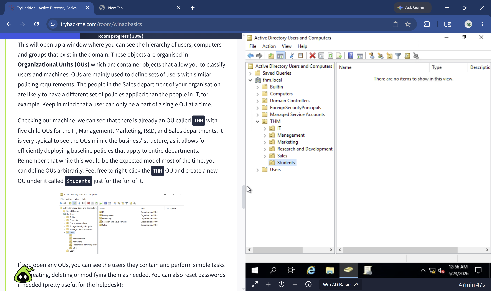
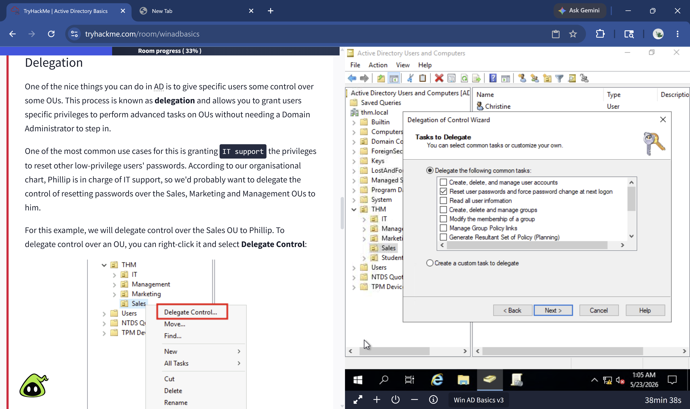
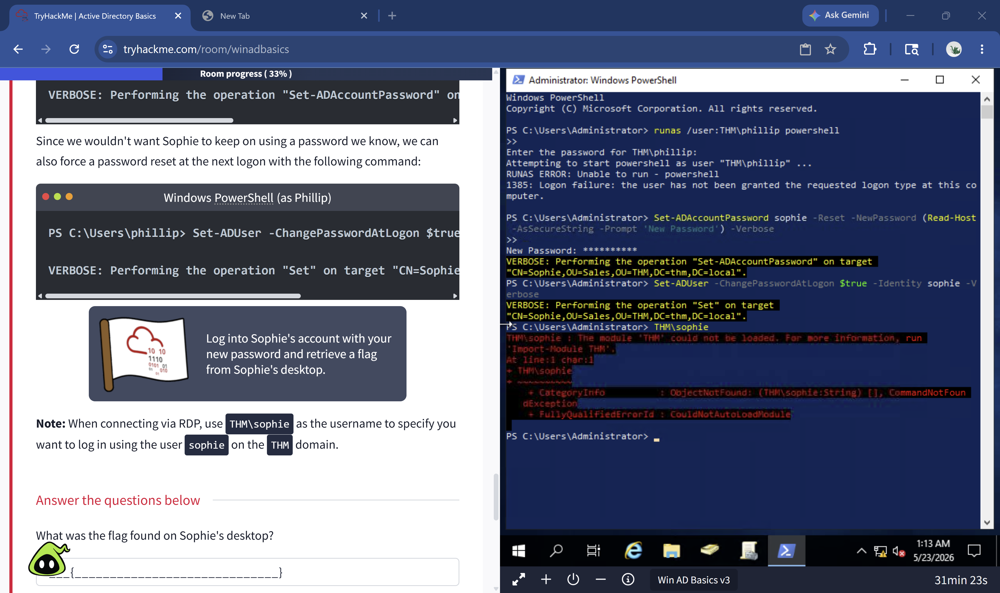
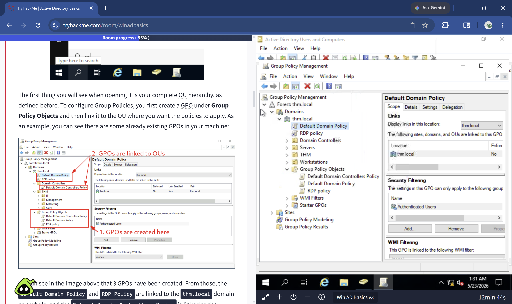
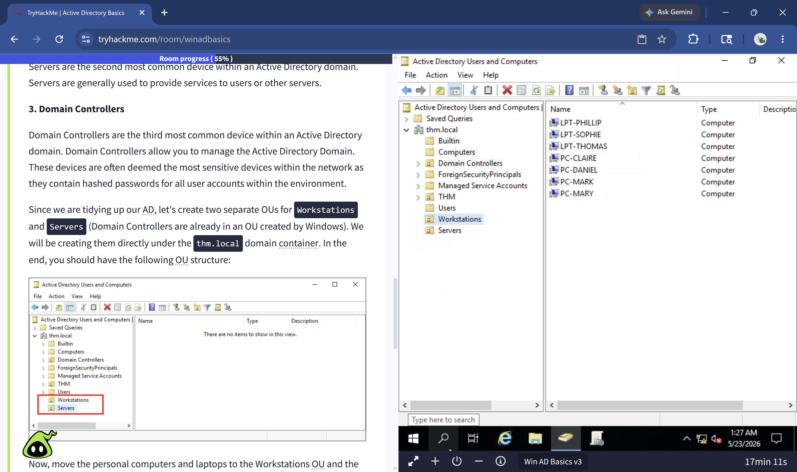
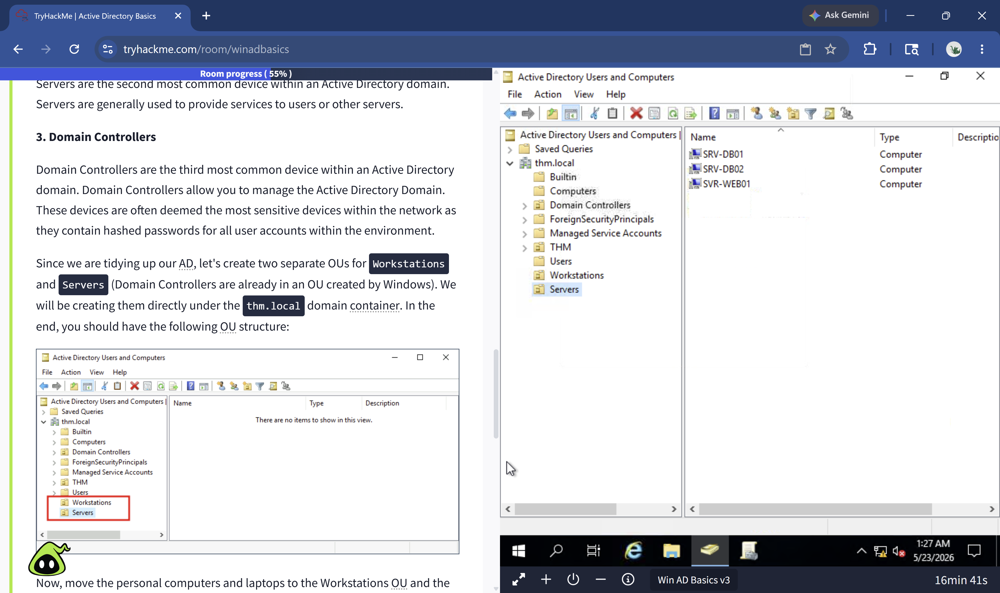

# Active Directory Identity Management Lab

**Platform:** TryHackMe — Active Directory Basics Room  
**Tools:** Windows Server 2019, Active Directory Domain Services, 
Group Policy Management, PowerShell  
**Environment:** Browser-based Windows Server VM — no local 
installation required  
**Focus Areas:** Identity Lifecycle Management, Group Policy, 
Delegation, Authentication, AD Structure  

---

## Overview

This project documents my hands-on exploration of Active Directory 
in an enterprise-simulated environment. I configured OUs, managed 
user accounts, delegated administrative control, reorganized 
computer objects, and enforced security policy through Group Policy 
Objects — simulating real IAM and SOC analyst workflows used in 
enterprise environments daily.

This lab directly mirrors the identity lifecycle management work 
I performed during my internship at the University of Texas System, 
where I applied least-privilege principles and managed access 
controls across systems serving thousands of users.

---

## Lab Environment & Setup

Accessed a pre-configured Windows Server 2019 Domain Controller 
via TryHackMe's browser-based VM — no local installation required.

| Field | Value |
|---|---|
| Domain | thm.local |
| Domain Controller | Win AD Basics v3 |
| Admin Credentials | THM\Administrator |
| Environment | Browser-based AttackBox |

---

## What is Active Directory

Active Directory (AD) is Microsoft's centralized identity and 
access management system used in virtually every enterprise 
Windows environment. It stores information about all objects on 
a network — users, computers, groups, printers, and services — 
and makes that information available for authentication and 
policy enforcement.

A Windows domain centralizes administration into a single 
repository called Active Directory. The server running AD is 
called the Domain Controller (DC) — the most critical and 
sensitive server in any enterprise network.

**Why organizations use AD:**
- Centralized identity management — configure all users from 
  one location instead of machine by machine
- Centralized security policy — deploy GPOs across the entire 
  network from one place
- Scalable — works the same whether you have 5 users or 50,000

---

## AD Structure & Object Types

| Object Type | Description |
|---|---|
| Users | Represent people or services. Security principals that can authenticate and be assigned privileges. |
| Machines | Every computer joining the domain gets a machine account. Named with a $ suffix (e.g. DC01$). |
| Security Groups | Grant permissions over resources. Users can belong to many groups. |
| Organizational Units | Containers for applying GPOs. Users can only belong to one OU at a time. |

**Key distinction — OUs vs Security Groups:**
- OUs → apply policies (GPOs) to sets of users or computers
- Security Groups → grant access to resources like shared 
  folders or printers

**Default AD containers:**
- Builtin: default Windows groups
- Computers: machines joining the domain land here by default
- Domain Controllers: all DCs in the network
- Users: default domain-wide users and groups
- Managed Service Accounts: accounts used by services

**Important default security groups:**

| Group | Description |
|---|---|
| Domain Admins | Full administrative control over the entire domain |
| Account Operators | Can create or modify user accounts |
| Server Operators | Can administer Domain Controllers |
| Domain Users | Includes all user accounts in the domain |
| Domain Controllers | Includes all DCs in the domain |

---

## Managing Users in AD

### What I Did in the Lab
- Reviewed the existing OU structure against an organizational 
  chart and identified a decommissioned department OU
- Deleted the extra OU by disabling accidental deletion 
  protection via Advanced Features in the View menu
- Created and removed user accounts to match the updated 
  organizational chart
- Delegated password reset control over the Sales OU to Phillip 
  (IT support) without granting full Domain Admin rights
- Used PowerShell as a delegated user to reset a user password 
  and force a password change at next logon

### Delegation
Delegation allows specific users to perform advanced tasks on 
OUs without needing Domain Admin access. Most common use case: 
granting IT support the ability to reset passwords for 
low-privilege users in specific OUs only.

### PowerShell Commands Used
```powershell
# Reset a user password as a delegated user
Set-ADAccountPassword sophie -Reset -NewPassword (Read-Host `
  -AsSecureString -Prompt 'New Password') -Verbose

# Force password change at next logon
Set-ADUser -ChangePasswordAtLogon $true -Identity sophie -Verbose
```

**Real-world SOC connection:** At the University of Texas System 
I applied least-privilege principles in a live enterprise 
environment — delegation is exactly how that works in AD. IT 
support resets passwords without having full admin rights over 
the entire domain.

---

## Managing Computers in AD

### Computer Categories in AD

| Category | Description | Policy Priority |
|---|---|---|
| Workstations | Daily user devices. Should never have privileged users signed in. | Standard user policy |
| Servers | Provide services to users or other servers. | Stricter policy |
| Domain Controllers | Most sensitive devices — contain hashed passwords for ALL users. | Highest restriction |

### What I Did in the Lab
- Created two new OUs directly under thm.local: 
  **Workstations** and **Servers**
- Moved 7 personal computers and laptops from the default 
  Computers container into the Workstations OU
- Moved 3 servers (SRV-DB01, SRV-DB02, SVR-WEB01) into 
  the Servers OU
- Left Domain Controllers in their existing default OU

**Why this matters:** Separating computers into OUs allows 
different GPOs to be applied per category. Servers receive 
stricter policies than workstations. This is fundamental to 
least-privilege enforcement across an enterprise environment.

---

## Group Policy Objects (GPOs)

### What is a GPO
A Group Policy Object is a collection of settings applied to 
OUs to enforce security baselines and configurations across 
users and computers in the domain.

### GPOs Configured in This Lab

| GPO | Scope | Purpose |
|---|---|---|
| Default Domain Policy | thm.local (entire domain) | Password policy, account lockout settings |
| Restrict Control Panel Access | Marketing, Management, Sales OUs | Prevent non-IT users from changing system settings |
| Auto Lock Screen | Root domain (inherited by all OUs) | Lock workstations after 5 minutes of inactivity |
| RDP Policy | thm.local | Remote desktop access control |

### GPO Distribution
GPOs are distributed via a network share called **SYSVOL** 
stored on the Domain Controller. All domain users sync GPOs 
from this share periodically.

Force immediate GPO sync:
```powershell
gpupdate /force
```

### GPO Inheritance
GPOs applied to a parent OU are inherited by all child OUs. 
Example: Auto Lock Screen applied to thm.local automatically 
affects Workstations, Servers, Sales, Marketing, and all 
other child OUs.

**Real-world SOC connection:** GPOs are how enterprises enforce 
security policy at scale without touching each machine 
individually. The access controls I worked with at UT System 
were enforced through AD policies exactly like these.

---

## Authentication Methods

### Kerberos (Default — Modern Windows)
Kerberos uses tickets instead of transmitting passwords over 
the network. The process:

1. User sends encrypted credentials to the Key Distribution 
   Center (KDC) on the Domain Controller
2. KDC returns a **Ticket Granting Ticket (TGT)** and Session Key
3. User presents TGT to request a **Ticket Granting Service (TGS)** 
   for a specific resource
4. TGS is presented to the target service to authenticate

**SOC relevance:** Kerberoasting attacks target service account 
TGS tickets. Detecting abnormal TGS requests is a key SOC 
detection use case.

### NetNTLM (Legacy — Kept for Compatibility)
Uses a challenge-response mechanism. The user's password hash 
is never transmitted over the network directly, but the 
protocol is considered weaker than Kerberos and should be 
monitored for abuse.

| | Kerberos | NetNTLM |
|---|---|---|
| Default in modern Windows | Yes | No |
| Password sent over network | No | No |
| Uses tickets | Yes | No |
| Attack surface | Kerberoasting, Golden Ticket | Pass-the-Hash, NTLM relay |

---

## Trees, Forests and Trusts

| Concept | Definition |
|---|---|
| Tree | A group of Windows domains sharing the same namespace (e.g. thm.local, uk.thm.local) |
| Forest | A collection of multiple trees with different namespaces joined into one network |
| Trust Relationship | Configured between domains to allow users in one domain to access resources in another |
| One-way Trust | Domain AAA trusts BBB — users in BBB can access resources in AAA |
| Two-way Trust | Both domains mutually authorize each other's users. Default when joining a tree or forest |

**Enterprise Admins** group grants administrative privileges 
over ALL domains in an enterprise — above Domain Admins who 
only control their single domain.

**SOC relevance:** Trust relationships are a common lateral 
movement path in enterprise attacks. A SOC analyst needs to 
understand domain trusts to trace how attackers move between 
domains during an incident.

---

## Screenshots

### AD OU Structure — thm.local Domain


### Delegation of Control Wizard — Sales OU


### PowerShell — Password Reset as Delegated User


### Group Policy Management Console


### Workstations OU — 7 Computers Moved


### Servers OU — 3 Servers Moved


---

## Key Takeaways

- Active Directory is the backbone of enterprise identity 
  management — understanding it is fundamental for both 
  SOC and IAM analyst roles
- Delegation enables least-privilege enforcement at scale — 
  IT support can reset passwords without Domain Admin rights
- GPOs enforce security policy across thousands of endpoints 
  from a single location — no manual machine-by-machine config
- Separating computers into OUs (Workstations vs Servers) 
  enables targeted policy enforcement and reduces attack surface
- Kerberos ticket-based authentication is the foundation of 
  enterprise SSO — and the target of some of the most common 
  AD attacks (Kerberoasting, Golden Ticket)
- Trust relationships between domains are a critical lateral 
  movement vector that SOC analysts must understand to 
  investigate enterprise incidents

---

## Real-World Connection

This lab directly mirrors my experience as an Information 
Security Analyst Intern at the University of Texas System, 
where I:
- Applied least-privilege principles across systems serving 
  thousands of users
- Managed identity lifecycle workflows including provisioning, 
  deprovisioning, and access control
- Worked within an enterprise AD environment enforcing RBAC 
  and access integrity

Active Directory is not just a lab tool — it is the identity 
infrastructure of virtually every enterprise I will work in 
as a SOC or IAM analyst.

---

## Skills Demonstrated

- Active Directory administration and navigation
- Organizational Unit design and management
- User provisioning, deprovisioning, and modification
- Delegation of administrative control
- PowerShell for AD user management
- Group Policy Object creation and linking
- Computer object organization and OU segregation
- Kerberos and NetNTLM authentication concepts
- Enterprise identity lifecycle management
