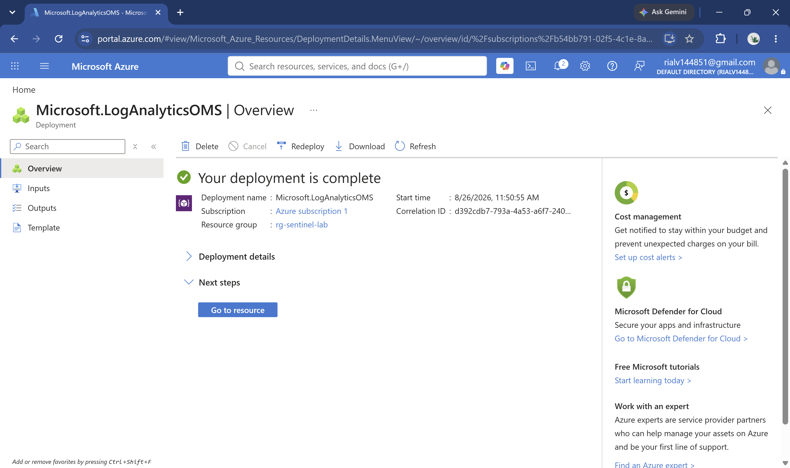
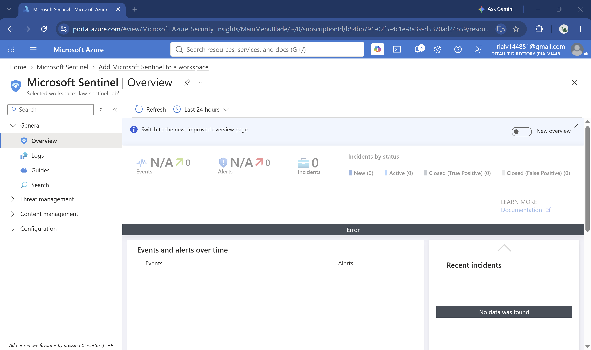
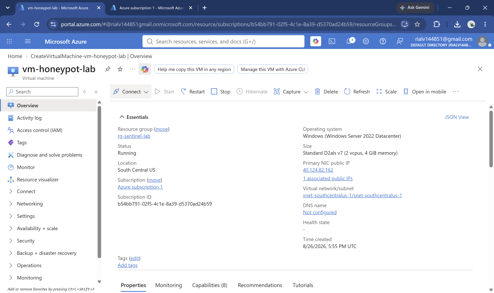
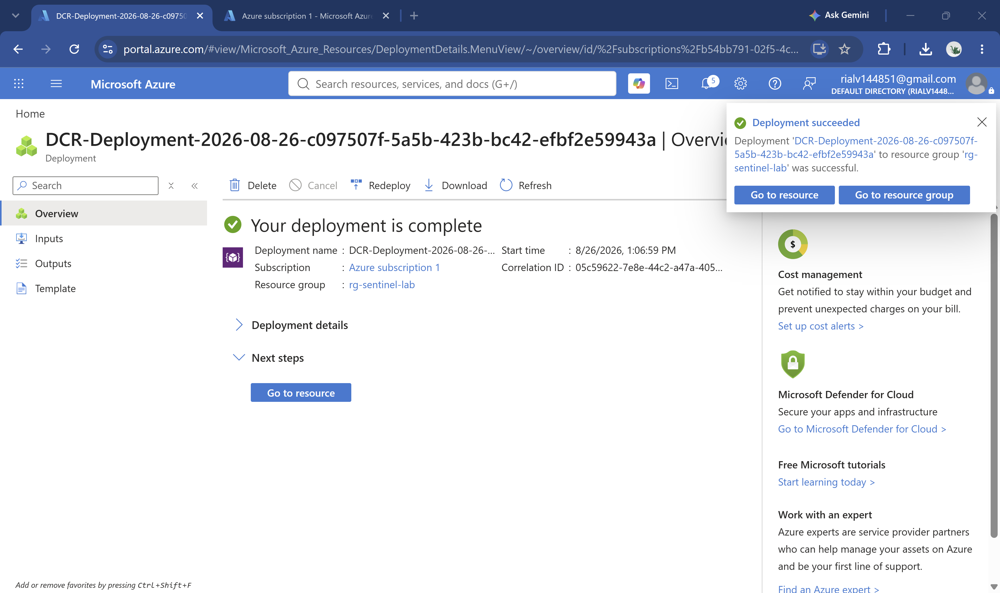
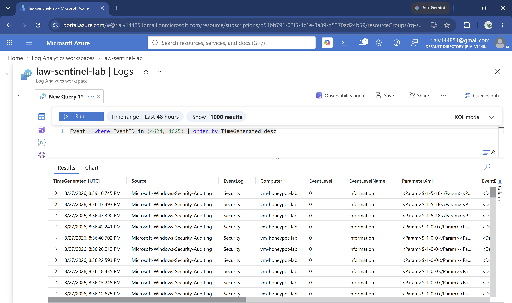
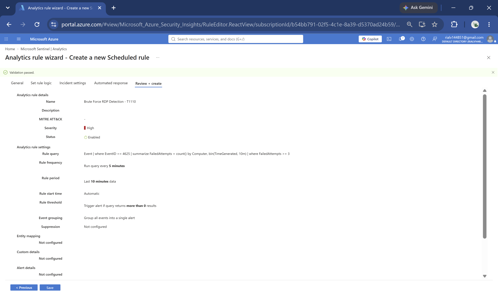
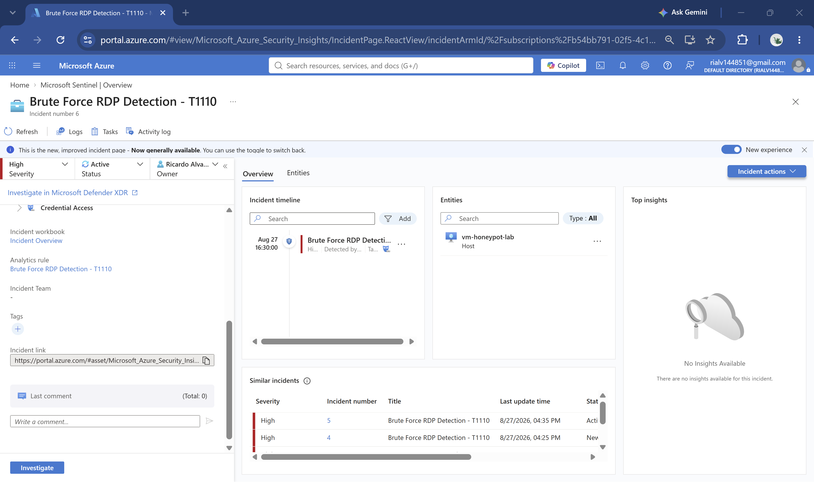
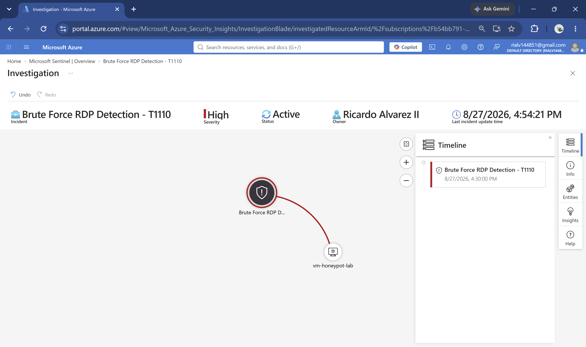
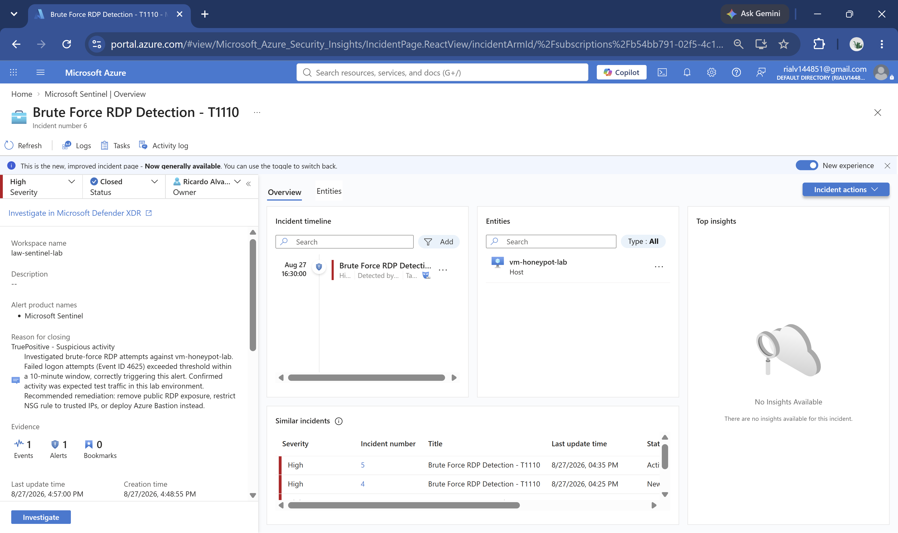
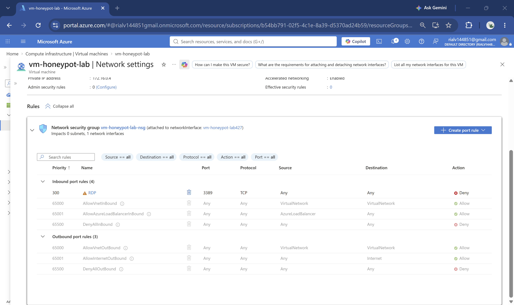

# Microsoft Sentinel SOC Simulation Lab

A self-directed SOC detection lab built in Microsoft Azure. I deployed a Windows VM, intentionally exposed it to the internet via RDP, connected it to Microsoft Sentinel, wrote a custom KQL detection rule mapped to MITRE ATT&CK T1110 (Brute Force), investigated the resulting incident, and remediated the exposure — the full exposure → detection → investigation → remediation lifecycle.

Unlike an earlier undocumented honeypot project I followed from a guided tutorial, the detection logic, entity mapping, incident investigation, and remediation steps here were designed and executed independently.

## Tools Used
- Microsoft Sentinel
- Log Analytics Workspace
- Azure Monitor Agent
- Data Collection Rules (DCR)
- KQL (Kusto Query Language)
- Azure Virtual Machines
- Network Security Groups (NSG)

## Environment
| | |
|---|---|
| **Platform** | Microsoft Azure (Pay-As-You-Go) |
| **VM** | vm-honeypot-lab — Standard D2als_v7, Windows Server 2022 Datacenter, South Central US |
| **Workspace** | law-sentinel-lab in resource group rg-sentinel-lab |
| **MITRE Tactic** | T1110 — Brute Force (Credential Access) |
| **Total cost** | ~$0.72, covered by Azure free credit |

---

## Step 1: Deploy the Log Analytics Workspace

Created a Log Analytics workspace to serve as the foundation for Sentinel — every log Sentinel analyzes has to land somewhere first.



## Step 2: Enable Microsoft Sentinel

Enabled Sentinel on top of the workspace. This is what turns a passive log store into an active SIEM capable of running detection rules and generating incidents.



## Step 3: Deploy the Honeypot VM

Deployed a Windows Server 2022 VM and intentionally exposed RDP (port 3389) to the internet — the deliberate misconfiguration this lab is built to detect.

**Real troubleshooting along the way:** the smallest VM size (B1s) is a B-series v1 SKU that Microsoft is retiring platform-wide, and it was blocked outright on this subscription — not a regional issue, since switching regions didn't fix it. The next attempt (B2ats_v2) passed the size picker but failed at deployment with a `QuotaExceeded` error (limit of 0 for that VM family), and a self-service quota increase request was automatically rejected. I settled on **Standard D2als_v7**, which had quota available with zero extra steps — a good reminder that Azure's newest VM generations often have better default availability than "budget" legacy sizes.



## Step 4: Connect the VM to Log Analytics

Built a Data Collection Rule (DCR) to forward Windows Security Event Logs — specifically Event ID 4624 (successful logon) and 4625 (failed logon) — from the VM into the Log Analytics workspace.



## Step 5: Confirm Real Events Are Flowing

**Key finding I can defend:** a generic Azure Monitor Agent "Windows Event Logs" data source routes data into the `Event` table — not the `SecurityEvent` table that Sentinel's dedicated Security Events connector uses. My first several KQL queries came back empty even though the Azure Monitor Agent was confirmed healthy (via the `Heartbeat` table) and Windows Event Viewer confirmed the logon events existed locally on the VM. I isolated the discrepancy by checking Event Viewer directly on the VM before correctly identifying it as a log-routing issue rather than an auditing or agent failure, and adjusted every downstream query to use the `Event` table instead.

```kql
Event
| where EventID in (4624, 4625)
| order by TimeGenerated desc
```



## Step 6: Write the Detection Rule

Built a Scheduled Query Rule that counts failed logon attempts per host and triggers an alert when a threshold is exceeded, mapped to MITRE ATT&CK **T1110 (Brute Force)**, with Entity Mapping configured so triggered incidents populate a visual investigation graph.

```kql
Event
| where EventID == 4625
| summarize FailedAttempts = count() by Computer
| where FailedAttempts >= 3
```



## Step 7: Incident Generated with Entity Mapping

The rule fired and generated a High-severity incident, with `vm-honeypot-lab` correctly attached as a Host entity — this is what enables the investigation graph in the next step.



## Step 8: Investigate the Incident

Opened the investigation graph, which visually connects the incident to the affected host entity and timeline.



## Step 9: Close the Incident

Formally closed the incident as a **True Positive — Suspicious activity**, with a written closing note covering root cause, confirmation that the activity was expected test traffic, and recommended remediation:

> Investigated brute-force RDP attempts against vm-honeypot-lab. Failed logon attempts (Event ID 4625) exceeded threshold within a 10-minute window, correctly triggering this alert. Confirmed activity was expected test traffic in this lab environment. Recommended remediation: remove public RDP exposure, restrict NSG rule to trusted IPs, or deploy Azure Bastion instead.



## Step 10: Remediate

Applied the recommended fix — changed the VM's Network Security Group inbound rule for RDP (3389) from **Allow (Any source)** to **Deny**, closing the exposure the lab intentionally opened.



---

## Key Findings I Can Defend

- **Event vs. SecurityEvent table routing:** A generic Windows Event Logs DCR delivers to the `Event` table, not `SecurityEvent` — a common point of confusion when building custom Sentinel detections outside of Sentinel's purpose-built Security Events connector.
- **VM SKU availability on new subscriptions:** B-series v1 sizes are being retired and are commonly blocked for new Pay-As-You-Go subscriptions regardless of region; newer generation sizes (v7) had quota available with no extra configuration.
- **Entity mapping is required for investigation graphs:** without explicitly mapping a query column to a Host/Account entity, Sentinel incidents show "No Entities" and the investigation graph is blocked — even when the underlying alert and data are correct.

## Interview Note

This project demonstrates the full SOC detection lifecycle independently — exposure, detection engineering, incident investigation, and remediation — plus real infrastructure troubleshooting (VM SKU retirement, quota limits, log table routing) that mirrors the kind of unglamorous problem-solving a SOC or cloud security analyst encounters in production.
