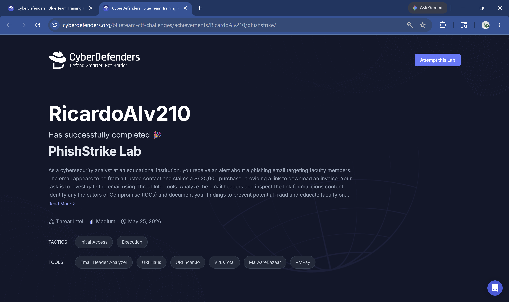
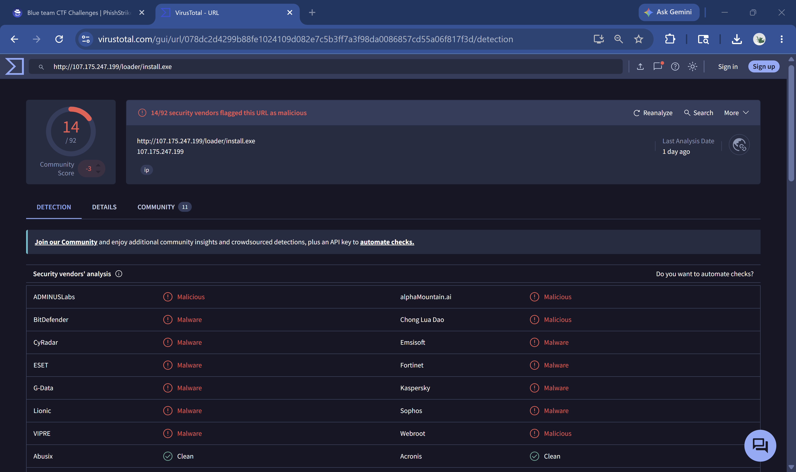
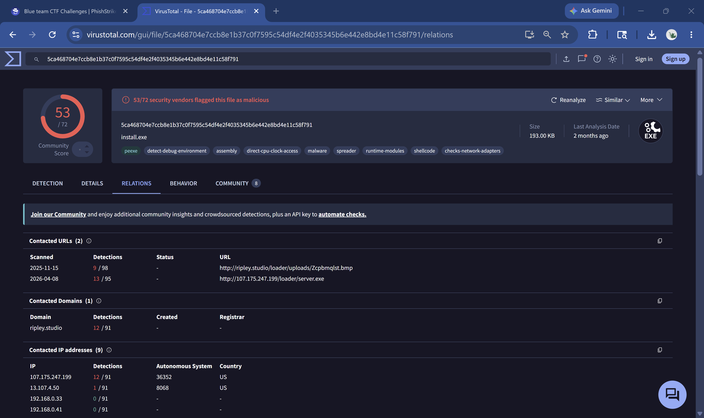
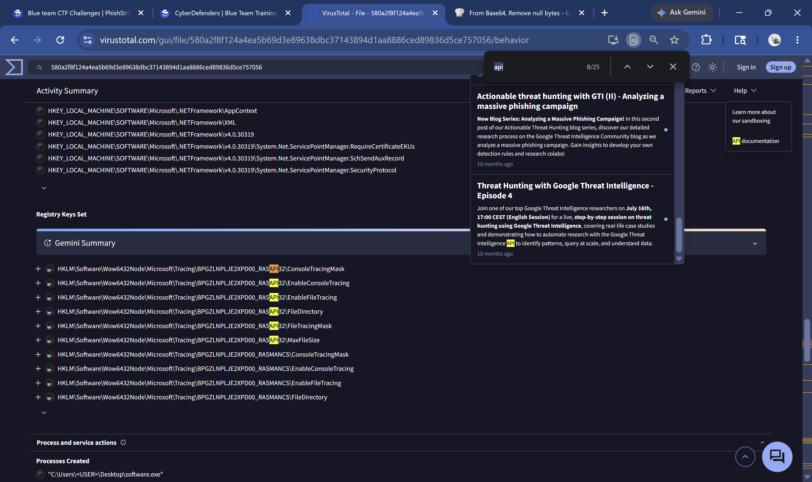
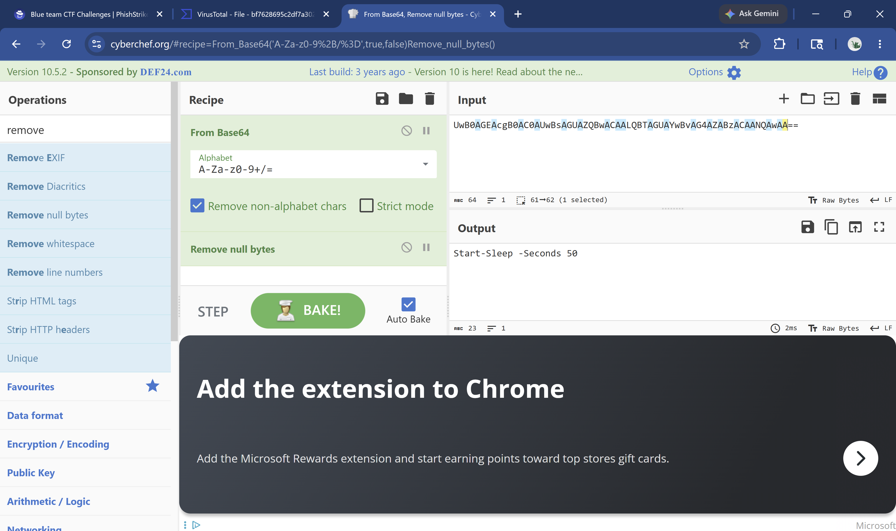

# Phishing Incident Response — CyberDefenders PhishStrike Lab

**Platform:** CyberDefenders | **Tools:** VirusTotal, MalwareBazaar, CyberChef, VMRay | **Focus:** Email Forensics, IOC Extraction, Malware Analysis, Threat Intelligence

---

## Overview

As part of building my SOC analyst portfolio, I completed the PhishStrike challenge on CyberDefenders — a medium-difficulty threat intelligence lab simulating a real phishing incident at an educational institution. The scenario involved a spoofed faculty email claiming a $625,000 purchase and containing a link to a malicious executable. I analyzed the raw email headers, extracted IOCs, traced a multi-stage malware delivery chain, and documented findings across three malware families: CoinMiner, BitRAT, and AsyncRAT. This lab directly mirrors the phishing triage workflow I performed during my internship at the University of Texas System.

---

## Lab Environment

| Component | Details |
|-----------|---------|
| Platform | CyberDefenders — PhishStrike (Retired) |
| Difficulty | Medium |
| Category | Threat Intelligence |
| MITRE Tactics | Initial Access, Execution |
| Tools Used | VirusTotal, MalwareBazaar, CyberChef, VMRay, URLhaus |
| Completion | 11/11 Questions — 100% |

---

## Scenario

A cybersecurity analyst at an educational institution receives an alert about a phishing email targeting faculty members. The email claims a $625,000 purchase has been completed and provides a link to download an invoice. The task is to investigate the email headers, identify IOCs, analyze the malware delivery chain, and document findings.

---

## Email Header Analysis

The raw `.eml` file revealed multiple authentication failures and a clear spoofing attempt:

| Header Field | Value |
|---|---|
| From | erikajohana.lopez@uptc.edu.co |
| Subject | COMMERCIAL PURCHASE RECEIPT ONLINE 27 NOV |
| Sending IP | 18.208.22.104 |
| SPF Result | SoftFail |
| DKIM Result | Fail |
| DMARC Result | None |
| Date | Thu, 9 Dec 2022 |

SPF softfail combined with DKIM failure and no DMARC policy are immediate red flags indicating the sender domain was either spoofed or compromised. The email was routed through Google mail servers before reaching the target, a common technique to add legitimacy to the sending path.

---

## Malware Delivery Chain

The phishing email contained a single malicious URL leading to a multi-stage malware delivery chain:
All payloads were disguised as image files (`.jpeg`, `.png`, `.bmp`) to bypass content filters — a classic evasion technique.

---

## IOCs Extracted

| IOC | Type | Verdict | Details |
|-----|------|---------|---------|
| 18.208.22.104 | IP | Suspicious | SPF softfail sender IP |
| 107.175.247.199 | IP | Malicious | Payload hosting server (AS36352 HostPapa) |
| http://107.175.247.199/loader/install.exe | URL | Malicious | Initial loader — 14/92 engines |
| http://107.175.247.199/loader/server.exe | URL | Malicious | BitRAT payload — 13/95 engines |
| http://ripley.studio/loader/uploads/Qanjttrbv.jpeg | URL | Malicious | CoinMiner C2 payload |
| bf7628695c2df7a3020034a065397592a1f8850e59f9a448b555bc1c8c639539 | SHA-256 | Malicious | BitRAT sample — 49/72 engines |
| ripley.studio | Domain | Malicious | C2 domain — 12/91 engines |
| gh9st.mywire.org | Domain | Malicious | BitRAT C2 domain |
| bot5610920260 | Telegram Bot ID | Malicious | AsyncRAT exfiltration channel |

---

## Malware Families Identified

**CoinMiner**
Downloads a fake image file (`Qanjttrbv.jpeg`) that is actually a cryptocurrency mining payload. Mines Monero using victim CPU resources without detection.

**BitRAT**
A remote access trojan delivered by the loader via `server.exe`. Establishes persistence by adding `Jzwvix.exe` to the Windows autorun registry key at `HKEY_CURRENT_USER\Software\Microsoft\Windows\CurrentVersion\Run`. Communicates with C2 domain `gh9st.mywire.org`.

**AsyncRAT**
Uses Telegram Bot API (`bot5610920260`) for data exfiltration and command execution — abusing a legitimate service to blend in with normal traffic and evade network-based detection.

---

## Persistence Mechanism

BitRAT achieved persistence via Windows Registry autorun:
This ensures the malware survives system reboots without requiring elevated privileges.

---

## Sandbox Evasion Technique

The malware executed a PowerShell command to delay execution and evade sandbox analysis:

```powershell
# Base64 encoded command found in process tree:
UwB0AGEAcgB0AC0AUwBsAGUAZQBwACAALQBTAGUAYwBvAG4AZABzACAANQAwAA==

# Decoded via CyberChef (From Base64 + Remove null bytes):
Start-Sleep -Seconds 50
```

A 50-second sleep delay causes many automated sandboxes to time out before capturing malicious behavior.

---

## Real-World SOC Connection

This lab mirrors real Tier 1-2 SOC workflows in several ways:

- **Email triage** — analyzing raw headers for SPF/DKIM/DMARC failures is a daily task in any SOC receiving user-reported phishing
- **IOC enrichment** — cross-referencing indicators across VirusTotal, URLhaus, and MalwareBazaar is standard practice
- **Multi-stage malware analysis** — understanding loader → payload chains is critical for scoping incidents correctly
- **Persistence hunting** — checking autorun registry keys is a standard endpoint investigation step
- **C2 identification** — blocking `ripley.studio` and `gh9st.mywire.org` at the firewall would disrupt attacker control

During my internship at the University of Texas System I triaged phishing emails and enriched IOCs manually — this lab documents that same investigative process in a structured, documented format.

---

## Screenshots







---

## Key Takeaways

- SPF/DKIM/DMARC failures are reliable early indicators of spoofed or compromised sender domains
- Malware increasingly uses legitimate file extensions and services to evade detection
- Multi-stage loaders separate initial access from payload delivery to complicate attribution
- Telegram Bot APIs are an emerging C2 channel that is difficult to block without impacting legitimate users
- Sandbox evasion via sleep delays is common — always check for encoded PowerShell in process trees

---

## Skills Demonstrated

`Email Header Analysis` `IOC Extraction` `Threat Intelligence` `VirusTotal` `CyberChef` `Malware Analysis` `Persistence Detection` `Registry Forensics` `C2 Identification` `Sandbox Evasion Detection` `MITRE ATT&CK Mapping`
