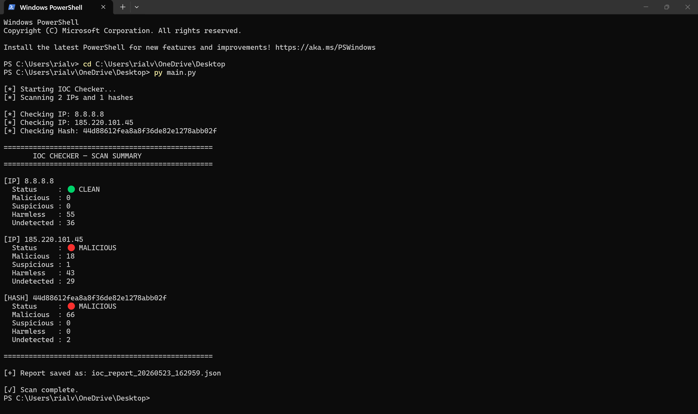
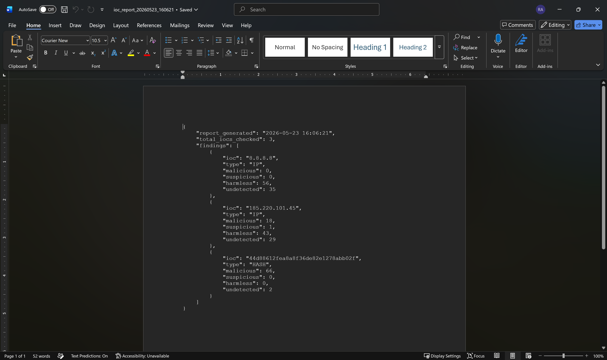

# Python IOC Checker — VirusTotal API Integration

**Platform:** Python 3.14 | **Tools:** VirusTotal API, Requests Library | **Focus:** SOC Automation, IOC Enrichment, Threat Detection

---

## Overview

As part of building my SOC analyst portfolio, I developed a Python script that automates the process of checking Indicators of Compromise (IOCs) against the VirusTotal API. During my internship at the University of Texas System, I triaged phishing alerts and enriched IOCs manually — this script simulates that same workflow but automates it. The tool accepts IP addresses and file hashes, queries VirusTotal's threat intelligence database, prints a color-coded terminal summary, and saves a timestamped JSON report for documentation.

---

## Lab Environment

| Component | Details |
|-----------|---------|
| Language | Python 3.14 |
| API | VirusTotal Free Tier (500 lookups/day) |
| Libraries | requests, json, datetime |
| OS | Windows 11 |
| Output | JSON report + terminal summary |

---

## How It Works

The script is structured into four components:

1. **Configuration** — API key and target IOCs defined at the top
2. **Lookup Functions** — `check_ip()` and `check_hash()` query the VirusTotal v3 API
3. **Report Generator** — saves findings as a timestamped JSON file
4. **Summary Printer** — outputs a color-coded terminal summary with detection counts

---

## IOCs Tested & Findings

| IOC | Type | Malicious | Suspicious | Harmless | Status |
|-----|------|-----------|------------|----------|--------|
| 8.8.8.8 | IP | 0 | 0 | 56 | 🟢 CLEAN |
| 185.220.101.45 | IP | 18 | 1 | 43 | 🔴 MALICIOUS |
| 44d88612fea8a8f36de82e1278abb02f | Hash | 66 | 0 | 0 | 🔴 MALICIOUS |

**185.220.101.45** is a known Tor exit node frequently used in attack campaigns — flagged by 18 engines.

**44d88612fea8a8f36de82e1278abb02f** is the EICAR test hash used to validate malware detection — flagged by 66 engines.

---

## Sample Commands

```python
# Add IPs to check
iocs = {
    "ips": ["8.8.8.8", "185.220.101.45"],
    "hashes": ["44d88612fea8a8f36de82e1278abb02f"]
}

# Run the script
py main.py
```

---

## Sample JSON Report Output

```json
{
    "report_generated": "2026-05-23 16:06:21",
    "total_iocs_checked": 3,
    "findings": [
        {
            "ioc": "185.220.101.45",
            "type": "IP",
            "malicious": 18,
            "suspicious": 1,
            "harmless": 43,
            "undetected": 29
        }
    ]
}
```

---

## Real-World SOC Connection

In a real SOC environment, Tier 1 analysts spend significant time manually enriching IOCs from phishing alerts, endpoint detections, and firewall logs. This script replicates that enrichment workflow and could be extended to:

- Accept IOC lists from a CSV file
- Integrate with a SIEM via API
- Auto-tag alerts based on detection thresholds
- Feed results into a ticketing system like ServiceNow

During my internship at the University of Texas System I performed this type of triage manually using Microsoft Defender and Abnormal AI — this project documents that same skill in code.

---

## Screenshots




---

## Key Takeaways

- Learned how to authenticate and interact with a real threat intelligence API
- Practiced structuring Python scripts in modular functions
- Understood how detection engines score IOCs across multiple vendors
- Produced a reusable tool that mirrors real SOC enrichment workflows

---

## Skills Demonstrated

`Python` `REST API Integration` `IOC Enrichment` `Threat Intelligence` `JSON Reporting` `SOC Automation` `VirusTotal` `Security Scripting`
