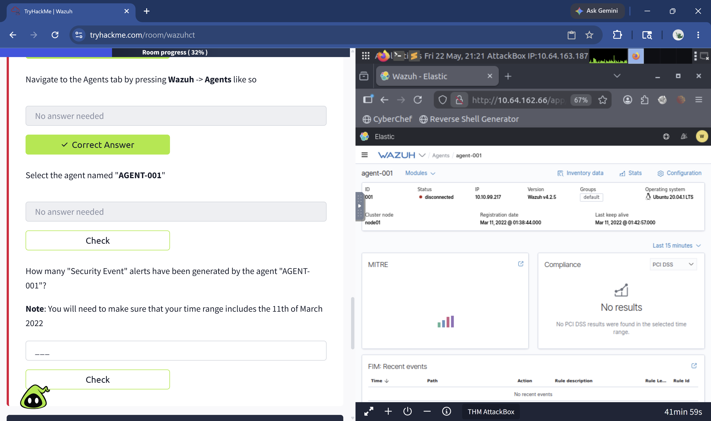
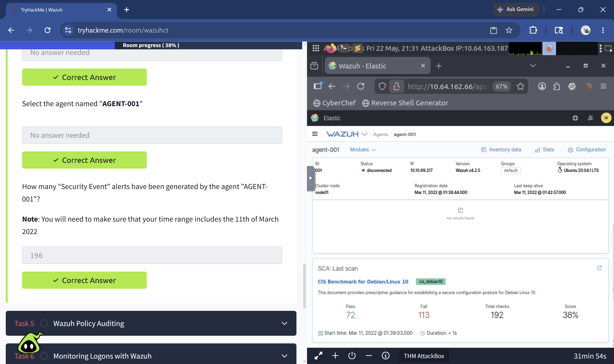
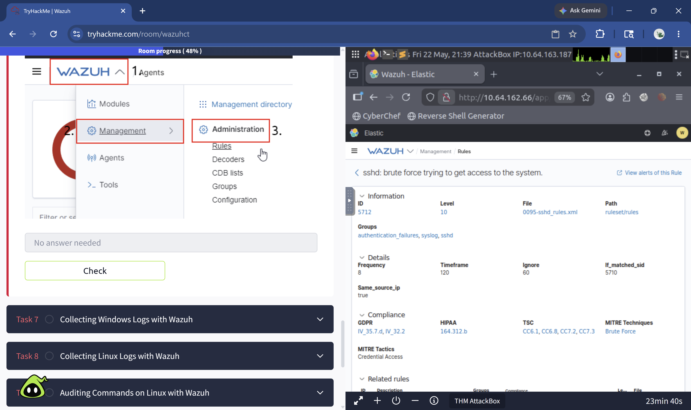

# Wazuh SIEM Lab

**Platform:** TryHackMe — Wazuh Room  
**Tools:** Wazuh v4.2.5, Elastic/Kibana, Sysmon, auditd  
**Environment:** Browser-based AttackBox — no local installation required  
**Focus Areas:** Threat Detection, Log Analysis, Compliance Auditing, MITRE ATT&CK  

---

## Overview

This project documents my hands-on exploration of Wazuh, an 
open-source SIEM and XDR platform used in enterprise SOC environments. 
I configured and analyzed a live Wazuh deployment, investigated 
security alerts, reviewed compliance scores, and mapped detections 
to the MITRE ATT&CK framework — simulating real Tier 1 SOC analyst 
workflows.

---

## What is Wazuh

Wazuh started as an EDR (Endpoint Detection and Response) tool but 
has evolved into a full security platform. It combines vulnerability 
assessment, threat detection, compliance reporting, and log monitoring 
all in one place. SOC teams use it because it centralizes visibility 
across all endpoints into a single dashboard — making it easier to 
detect and respond to threats quickly.

In enterprise environments Wazuh is commonly deployed as a SIEM 
solution, collecting logs from agents installed on Windows and Linux 
endpoints and correlating them into actionable alerts.

---

## Lab Environment & Setup

Deployed a pre-configured Wazuh management server via TryHackMe's 
browser-based AttackBox — no local installation required.

Accessed the Wazuh web interface (Kibana-based dashboard) via HTTPS 
and authenticated using provided credentials. Selected Global Tenant 
upon login to access the full Wazuh environment.

> Note: Agents in this lab show as disconnected — this is expected 
> behavior in a pre-configured training environment.

---

## Agents & Endpoints

Agents are installed on devices to monitor and record system events 
including authentication, user management, and processes. They offload 
logs to a central collector — the Wazuh management server.

**To deploy an agent you need:**
- Target OS (Windows or Linux)
- Wazuh server IP or DNS address
- Agent group assignment

**Deployment wizard location:** Wazuh > Agents > Deploy New Agent

**Agent investigated in this lab:**

| Field | Value |
|---|---|
| Agent Name | agent-001 |
| IP Address | 10.10.99.217 |
| Operating System | Ubuntu 20.04.1 LTS |
| Wazuh Version | v4.2.5 |
| Registration Date | Mar 11, 2022 |

---

## Security Events & Alerts

AGENT-001 generated **196 Security Event alerts** on March 11, 2022.

**Security Configuration Assessment (SCA) against CIS Benchmark 
for Debian/Linux 10:**

| Metric | Value |
|---|---|
| Total Checks | 192 |
| Passed | 72 |
| Failed | 113 |
| Compliance Score | 38% |

A 38% CIS compliance score indicates significant misconfiguration 
on the endpoint. In a real SOC environment this would trigger 
remediation actions and a follow-up audit with the system owner.

---

## Threat Detection & MITRE ATT&CK Mapping

Wazuh rule **5712** detects failed SSH login attempts using 
non-existent usernames — a brute force indicator.

| Field | Value |
|---|---|
| Rule ID | 5712 |
| Severity Level | 10 |
| MITRE Technique | Brute Force |
| MITRE Tactic | Credential Access |
| MITRE ID | T1110 |
| Compliance | GDPR, HIPAA, TSC |
| Log Source | /var/log/auth.log |

Alerts are stored on the Wazuh server at: 
`/var/ossec/logs/alerts/alerts.log`

Real-world SOC relevance: Rule 5712 firing repeatedly from the 
same source IP would indicate an active brute force attack and 
trigger escalation to Tier 2 for investigation and potential 
IP block.

---

## Log Monitoring

**Windows Log Collection:**  
Wazuh agent configured to ingest Sysmon events via ossec.conf, 
forwarding PowerShell execution logs and process creation events 
to the Wazuh manager for analysis.

**Linux Log Collection:**  
Wazuh agent configured via ossec.conf to ingest Apache2 logs 
using the 0250-apache_rules.xml ruleset. Wazuh includes 
approximately 900 pre-built rulesets covering Docker, FTP, 
WordPress, SQL Server, MongoDB, Firewalld, and more. Custom 
rules can also be created for environment-specific needs.

**Linux Command Auditing:**  
Wazuh uses the auditd package to monitor commands executed on 
Linux endpoints. Configured to track all commands run as root — 
a key indicator of privilege escalation or post-breach activity.

- Auditd rules: `/etc/audit/rules.d/audit.rules`
- Wazuh agent config: `/var/ossec/etc/ossec.conf`

> SOC relevance: auditd can flag high-risk commands like tcpdump, 
> netcat, or reading /etc/passwd — all common attacker behaviors 
> post-compromise.

---

## Wazuh API

Wazuh exposes a REST API on port 55000 allowing analysts to query 
agent status, manager configuration, and active services 
programmatically using curl or the built-in API console. 
Authentication uses token-based Bearer token auth.

**Example — Authenticate and store token:**
```bash
TOKEN=$(curl -u wazuh:password -k -X GET \
"https://WAZUH_IP:55000/security/user/authenticate?raw=true")
```

**Example — Query manager info:**
```bash
curl -k -X GET "https://WAZUH_IP:55000/manager/info" \
-H "Authorization: Bearer $TOKEN"
```

| HTTP Method | Use Case |
|---|---|
| GET | Retrieve information |
| PUT | Perform an action |
| POST | Create new data |
| DELETE | Remove data |

---

## Key Takeaways

- Wazuh centralizes endpoint visibility across Windows and Linux 
  into a single dashboard — reducing mean time to detect (MTTD)
- CIS Benchmark scoring gives SOC teams a clear picture of 
  endpoint hardening gaps before attackers exploit them
- MITRE ATT&CK integration means every alert maps to a real 
  adversary technique — enabling faster triage decisions
- Pre-built rulesets (~900) mean Wazuh can monitor most enterprise 
  applications out of the box with minimal configuration
- The REST API enables automation — analysts can script 
  queries and integrate Wazuh into broader SOAR workflows

---

## Screenshots

### Agent-001 Dashboard


### Security Events & CIS Compliance Score


### Rule 5712 — SSH Brute Force Detection (MITRE T1110)


---

## Skills Demonstrated

- SIEM deployment and navigation (Wazuh/Elastic stack)
- Alert triage and investigation
- CIS Benchmark compliance assessment
- MITRE ATT&CK threat mapping
- Windows and Linux log ingestion configuration
- REST API querying for SOC automation
